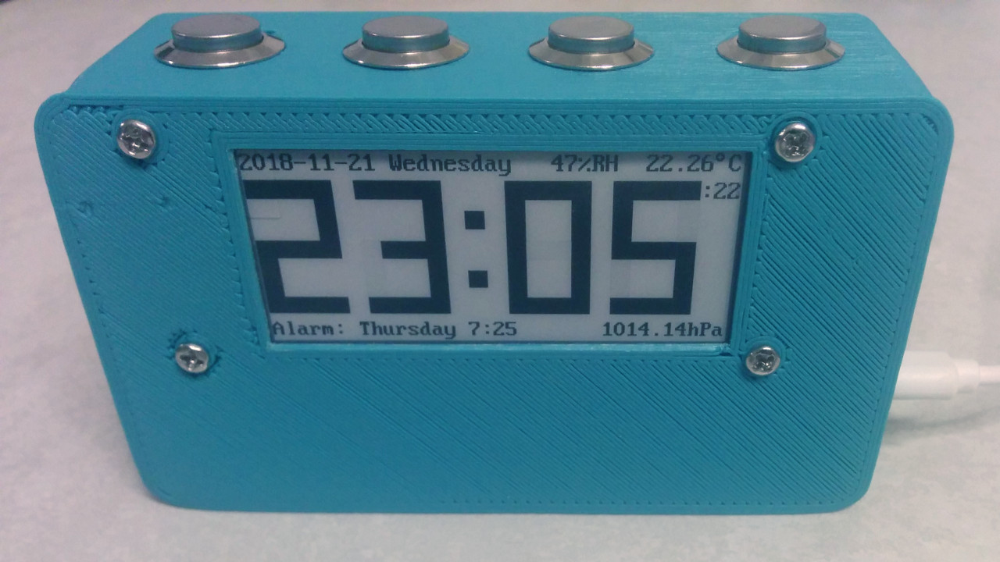
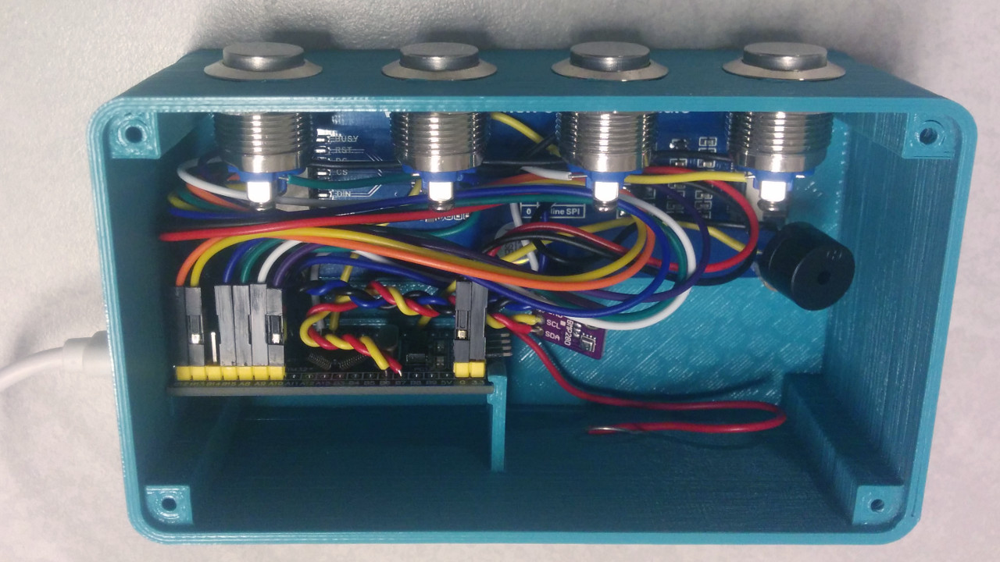

# Rusty clock 

An alarm clock with environment stats in pure bare metal embedded rust.

## Description

This alarm clock is programed in bare metal rust (no OS). It features pressure, temperature, humidity, monophonic alarm on a e-paper display.

## Hardware

The hardware used in this project is
- a [blue pill board](https://wiki.stm32duino.com/index.php?title=Blue_Pill) featuring a STM32F103C8 microcontroller (20KiB RAM, 64 KiB flash, ARM Cortex M3 @72MHz);
- a [2.9" WaveShare e-paper display](https://www.waveshare.com/wiki/2.9inch_e-Paper_Module) (296x128 black or white pixels);
- a [BME280 sensor](https://www.bosch-sensortec.com/bst/products/all_products/bme280) for temperature, humidity and pressure;
- a passive buzzer driven by PWM;
- 4 [16mm normally open push buttons](https://www.aliexpress.com/item/16mm-Metal-Push-Button-Switch-IP67-Waterproof-Nickel-plated-brass-press-button-Self-reset-1NO-High/32867071630.html) (cancel, previous, next, OK);
- a [3D printed case](cad/);
- USB power plug;
- micro USB cable;
- a CR20xx coin battery (optional);
- wires and soldering set;
- 4 2mm wood screws.

You also need a [ST-Link v2](https://www.aliexpress.com/wholesale?SearchText=stlink+v2) to flash and debug.

Everything can be purchased on [Aliexpress](https://www.aliexpress.com/). Budget is around US $35 without the 3D printed case and soldering set.

## Wiring

Everything is plugged directly to the blue pill board.

E-paper display to blue pill board:
- BUSY -> A10
- RST -> A9
- DC -> A8
- CS -> B12
- CLK -> B13
- DIN -> B15
- GND -> G
- VCC -> 3.3

BME280 to blue pill board:
- VIN -> 3.3
- GND -> G
- SCL -> B6
- SDA -> B7

Buttons are connected to the blue pill board between G and
- A6 for cancel
- A7 for previous
- B0 for next
- B1 for OK

Passive buzzer is connected to the blue pill board between G and A0.

Coin battery to blue pill board:
- (-) -> G
- (+) -> VB

Plug the micro USB connector of the blue pill board to a USB power supply (or a computer).

## Compiling and flashing

For compiling and flashing, please refer to [the blue pill quickstart](https://github.com/TeXitoi/blue-pill-quickstart/blob/master/README.md). Note that a nightly toolchain is required.
