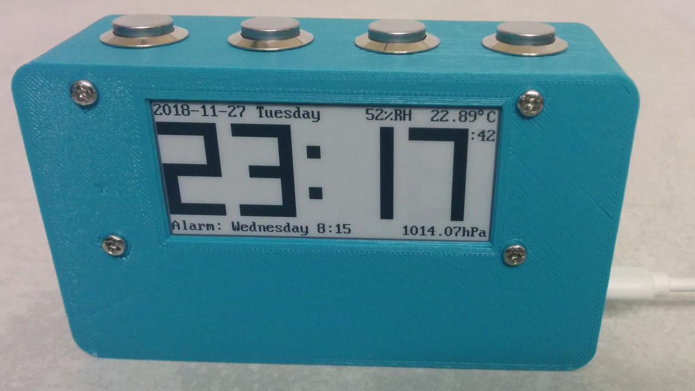

# Rusty clock [](https://travis-ci.org/TeXitoi/rusty-clock)

An alarm clock in pure bare metal embedded rust (no OS). It features pressure, temperature, humidity, monophonic alarm on a e-paper display. The 5 programmable alarms can ring one time (and never repeat) or every week day that you want (for example only Monday and Thursday).




You can also look at the [gallery](gallery.md).

## Hardware

The hardware used in this project is
- a [blue pill board](https://wiki.stm32duino.com/index.php?title=Blue_Pill) featuring a STM32F103C8 microcontroller (20KiB RAM, 64 KiB flash, ARM Cortex M3 @72MHz);
- a [2.9" WaveShare e-paper display](https://www.waveshare.com/wiki/2.9inch_e-Paper_Module) (296x128 black or white pixels);
- a [BME280 sensor](https://www.bosch-sensortec.com/bst/products/all_products/bme280) for temperature, humidity and pressure on a [I2C compatible PCB (VIN, GND, SCL and SDA pins)](https://www.aliexpress.com/item/a/32847825408.html);
- a [passive buzzer](https://www.aliexpress.com/item/a/32825515257.html) driven by PWM;
- 4 [16mm normally open push buttons](https://www.aliexpress.com/item/a/32867071630.html) (cancel, previous, next, OK);
- a [3D printed case](cad/);
- USB power plug;
- micro USB cable;
- a CR20xx coin battery (optional);
- wires (I use [single core wires](https://www.aliexpress.com/item/a/32832816460.html)) and soldering set;
- 4 2mm wood screws.

You also need a [ST-Link v2](https://www.aliexpress.com/item/a/32719963657.html) to flash and debug.

Everything can be purchased on [Aliexpress](https://my.aliexpress.com/wishlist/shared.htm?groupId=100000007706754). Budget is around US $35 without the 3D printed case and soldering set.

## Wiring

Everything is plugged directly to the blue pill board.

E-paper display to blue pill board:
- BUSY -> A10
- RST -> A9
- DC -> A8
- CS -> B12
- CLK -> B13
- DIN -> B15
- GND -> G
- VCC -> 3.3

BME280 to blue pill board:
- VIN -> 3.3
- GND -> G
- SCL -> B6
- SDA -> B7

Buttons are connected to the blue pill board between G and
- A6 for cancel
- A7 for previous
- B0 for next
- B1 for OK

Passive buzzer is connected to the blue pill board between G and A0.

Coin battery to blue pill board:
- (-) -> G
- (+) -> VB

Plug the micro USB connector of the blue pill board to a USB power supply (or a computer).

## Compiling and flashing

For compiling and flashing, please refer to [the blue pill quickstart](https://github.com/TeXitoi/blue-pill-quickstart/blob/master/README.md).

Basically:

```shell
curl https://sh.rustup.rs -sSf | sh
rustup target add thumbv7m-none-eabi
sudo apt-get install gdb-arm-none-eabi openocd
cd rusty-clock
# connect ST-Link v2 to the blue pill and the computer
# openocd in another terminal
cargo run --release
```
